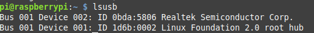

# Setting up the LCD-Screen

The library you will have to install will depend on your model. You should check in the site were you bought the LCD screen or on github/the raspberry pi stack exchange. For the model **XPT2046 Touch Controller (480x320 Pixel)** we use the libray [LCD Show](https://github.com/goodtft/LCD-show). For the 3.5inch screen, for example, we follow the instructions [here](http://www.lcdwiki.com/3.5inch_RPi_Display). But just to summarize, you just have to clone the library, add the appropriate permissions and the execute in the terminal

``` 
git clone https://github.com/goodtft/LCD-show.git
chmod -R 755 LCD-show
cd LCD-show/
sudo ./LCD35-show
``` 

them, just reboot the system and you're ready to go. The file which you have to execute in the end depends on the screen size, naturally.

# Running Videos on the Raspberry Pi and a camera

References:

- https://raspberrypi.stackexchange.com/questions/27876/can-i-run-a-terminal-command-from-ssh-to-open-the-browser-on-x-server/27881
- http://wiki.raspberrytorte.com/index.php?title=Monitor_a_Webcam
- https://superuser.com/questions/981932/mplayer-scale-video-to-window-size
- https://stackoverflow.com/questions/16750395/raspberry-pi-no-delay-10ms-video-stream

## 1 Installing the mplay to run videos

Here it's not very hard, just install the package

```
sudo apt-get install mplayer
``` 

If you are controlling the raspberry remotely, you may need to perform the following command:

```
export=DISPLAY:0
``` 

this will make all the graphical applications run in the LCD screen, even if you're working on the terminal. To run a video file just write

```
mplayer file_name
``` 

the software also has some additional commants. For example, if you want to open it in fullscreen, you can write:

```
mplayer -fs file_name
``` 

and so on. You can also pick a different resolution, for example:

```
mplayer -x 320 -y 240 file_name
``` 

## 2 Finding your camera and streaming the video record

Here we will use an usb camera, no the standard Raspberry Pi camera module.

### 2.1 Recognizing your camera

Execute 

```
lsusb
```

to check wether the system is recognizing your camera.



After that, check the video port with

```
ls /dev/video*
```

you'll probably get the default port /dev/video0. You can then stream it on the mplayer using (on fullscreen):

``` 
mplayer -fs tv:///dev/video0
```

to change the resolution we can use:

```
mplayer -fs -tv width=320:height=240 sample_video.mp4 
```

### 2.2 Streaming the video

Finally, if needed we can zoom in to get a full screen even with a lower resolution (but I saw no improvements regarding the delay):

``` 
mplayer -fs -tv width=320:height=240 -zoom tv:///dev/video0
```

```
mplayer -fs -tv width=320:height=240 tv:///dev/video0
````

There's a ssh script which executes all this stuff on the repository.

