# Communication with the Raspberry Pi through SSH (Secure Shell)

References:

- https://www.raspberrypi.org/documentation/remote-access/ssh/
- https://magpi.raspberrypi.org/articles/ssh-remote-control-raspberry-pi
- https://www.simplified.guide/ssh/copy-file

# Communication with the Virtual Machine

## 1 Figure out your IP adress

Simply write 

```shell
ifconfig
```
into the terminal of your raspberry pi. You will need the ip adress to establish a SSH connection.

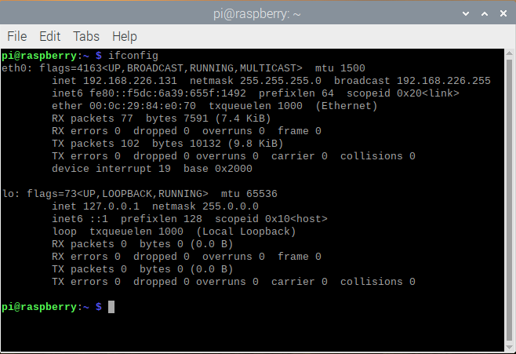

You may also see your IP in your start screen. 

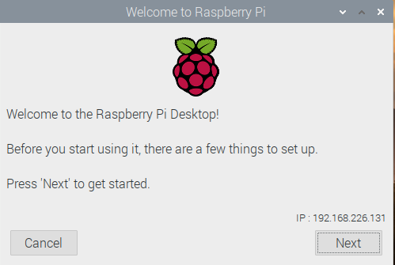

The IP here in our VM is 192.168.226.255. If this does not work you can also try to use the adress you get from

```shell
hostname -I
```

Here we got 192.168.0.57

## 2 Enable a SSH connection in your Raspberry Pi

Click on the Raspberry Pi icon on the menu. Then go to ``` Preferences > Raspberry Pi Configuration```

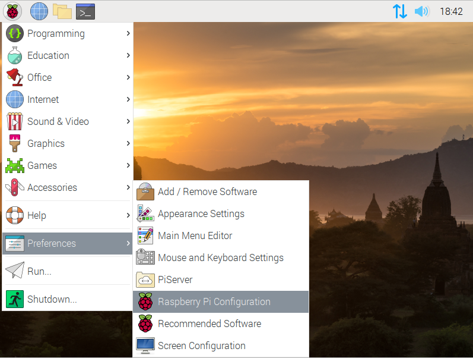

Go to ``` Interfaces > SSH ```. Click on enabled and we're set. 

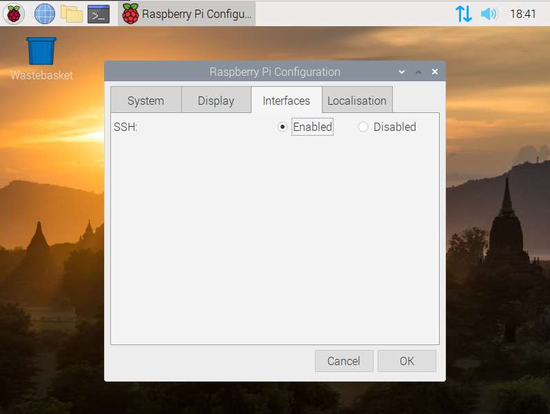

Now go back to your computer/host machine, open up the terminal and write the command

```shell
ssh raspberrypi_user@ip_adress
``` 

so, in our case we'd write

```shell
ssh pi@192.168.0.57
``` 

since I got the adress from the hostname command. When prompted to answer write *yes* and you'll have acess to your raspberry from your host machine:

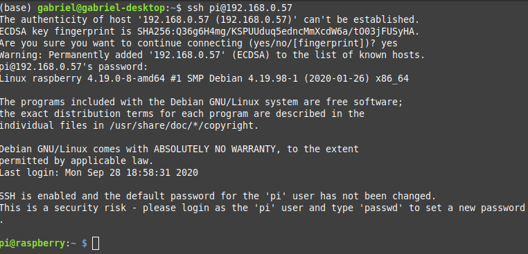

## 3 Openning existing files

To check out the stuff we can do with SSH let's make a quick test. Go to your homefolder in the raspberry pi/virtual machine and create a text file called *ssh_hello_world*, either graphically or through the terminal. 

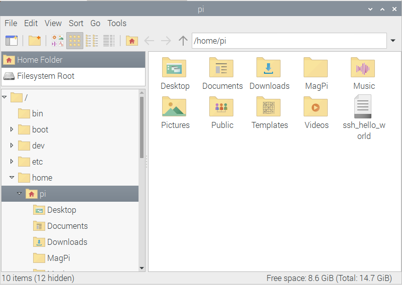

Now, we can use the text editor *nano* to open this text file. Just write:

```shell
nano ./ssh_hello_world
```

And we're done! Now just edit the file however your wish.

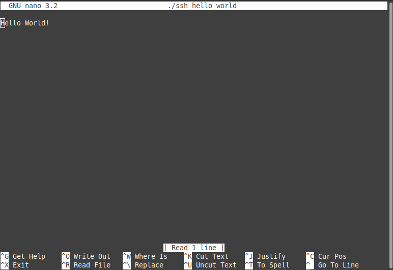

## 4 Sharing and copying files

Here we'll show how to send files from your host machine to your raspberry pi. First of all, create a folder on your home directory (in the host machine), called *PiShare*. You can write

```shell
mkdir PiShare
``` 

Do the same for the Raspberry Pi, you can create a folder called *PiShareReceive* for example. Now, create a text file called *SSH_Test* in the folder *PiShare* and write something on it. We'll try to open this file in the Raspberry Pi. To do that, use the *scp* command

```shell
scp PiShare/SSH_Test pi@192.168.0.57:PiShareReceiver
``` 

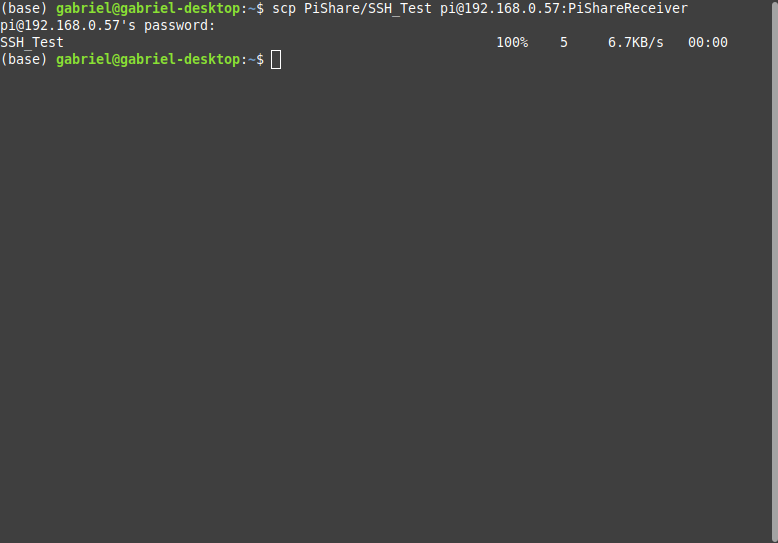

in general what you do is

```shell
scp local_folder/local file remote_user@remote_adress:remote_folder
``` 

you can also do the same from the remote to the local! After the end of the process you will see the copied file in the remote location:

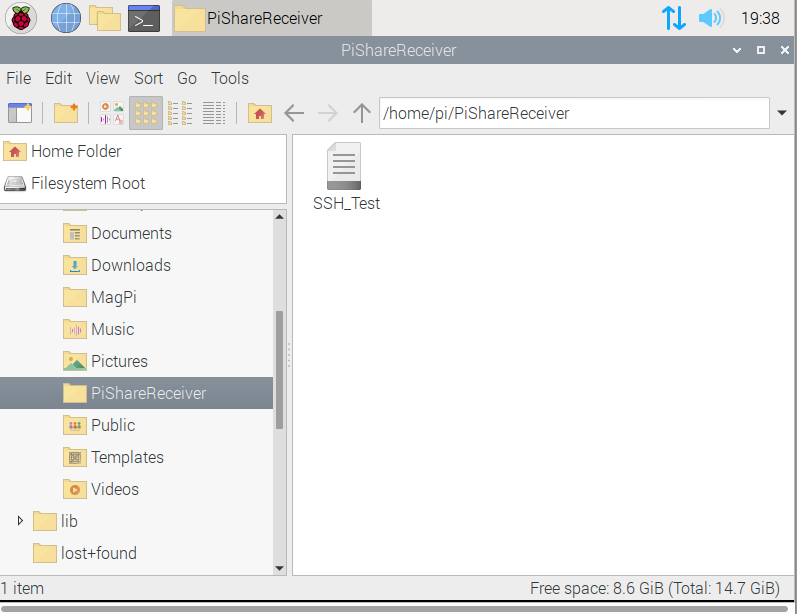

# Communication with the Raspberry Pi through the USB and the wi-fi

References:

- https://www.thepolyglotdeveloper.com/2016/06/connect-raspberry-pi-zero-usb-cable-ssh/
- https://desertbot.io/blog/ssh-into-pi-zero-over-usb
- https://blog.gbaman.info/?p=791
- https://raspberrypi.stackexchange.com/questions/73523/connect-pi-zero-via-usb-rndis-gadget-to-ubuntu-17-04
- https://www.raspberrypi.org/documentation/configuration/wireless/wireless-cli.md

## 1 Changing the boot files

After you burn the image on the SD, it's necessary to change some files so we can acess the device through SSH.

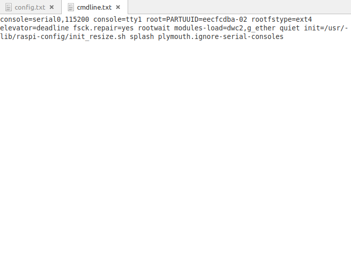

- 1. Go to the root folder in the SD cards, ```\boot``` and create an empty file called ```ssh```. This will turn the SSH communication on

- 2. Open the file ```config.txt```. Just add the line to the bottom of the file. This, together with the next file, establishes an ethernet connection with the computer

```
dtoverlay=dwc2
```

- 3. Open the file ```cmdline.txt```. Add the following code immediately after the word _rootwait_ in the file:

```
modules-load=dwc2,g_ether
```

## 2 Acessing the device

And now we're ready to go. You may see the connection as an ethernet cable. 

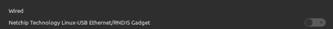

Turn it on. Then go to the network configurations, IpV4 and pick _force local link_. 

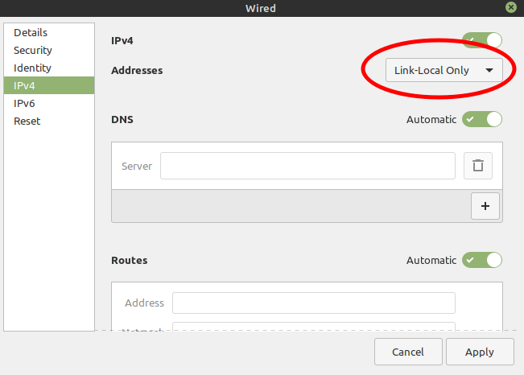

Now you can access it through the terminal. Just write:

```(shell)
ssh-keygen -R raspberrypi.local
ssh pi@raspberrypi.local
```

and you're done. The credentials are the same we used in the 
first tutorial.